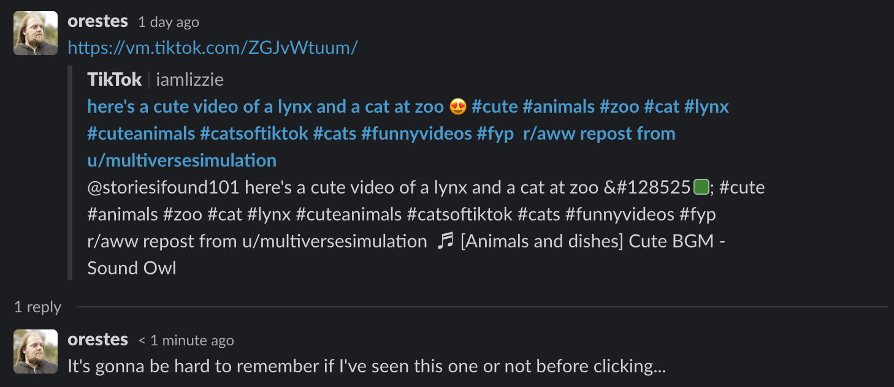
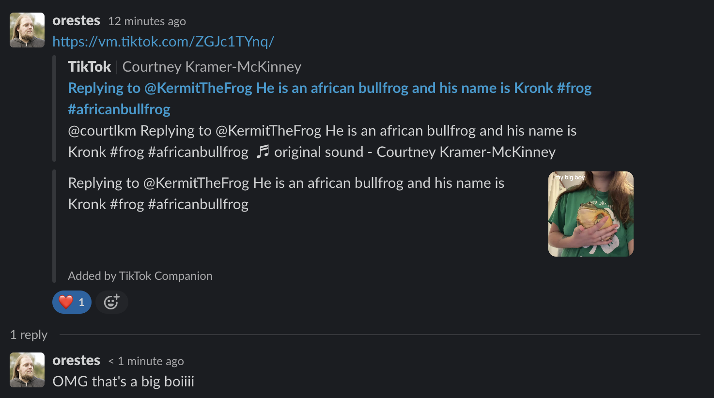

# tiktok-companion

A Slack App providing a better TikTok integration

# Demo

Before|After
-|-
|

# Features

- [x] Display the thumbnail for TikTok links in chat
- [ ] Thumbnail link is clickable

# Configuration

Create a Slack app using the following scopes:

- link_shared

Variable|Source
-|-
SLACK_BOT_TOKEN|_Slack Bot User OAuth Token_ in Slack App / OAuth settings
SLACK_APP_SECRET|_App signing secret_ Slack App / General settings

# Stack

## Runtime

- node@20

## Developer Experience

- TypeScript
- EditorConfig
- prettier
- Husky
- lint-staged
- commit-lint
- Changelog automation with semver + conventional changelog
